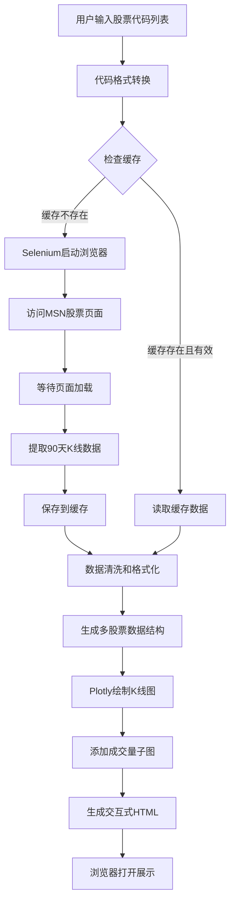

# 股票K线图项目架构设计

## 项目概述
使用Python开发的股票K线图展示系统，支持从MSN网站爬取数据，展示多股票对比的交互式K线图。

## 技术架构



## 核心模块设计

### 1. 项目结构
```
ai_stock/
├── requirements.txt          # 项目依赖
├── config.py                 # 配置文件
├── main.py                   # 主程序入口
├── modules/
│   ├── __init__.py
│   ├── code_converter.py    # 股票代码转换
│   ├── scraper.py           # 数据爬取模块
│   ├── cache_manager.py     # 缓存管理
│   ├── data_processor.py    # 数据处理
│   └── chart_generator.py   # 图表生成
├── cache/                    # 缓存目录
└── output/                   # 输出目录
    └── stock_chart.html
```

### 2. 技术栈

**核心依赖：**
- `selenium` (4.x) - 网页自动化
- `webdriver-manager` - 自动管理ChromeDriver
- `plotly` (5.x) - 交互式图表
- `pandas` - 数据处理
- `beautifulsoup4` - HTML解析

### 3. 模块功能说明

#### code_converter.py
- 功能：将通用股票代码转换为MSN格式
- 输入：通用代码（如 "600519"）
- 输出：MSN格式代码（如 "600519.SS"）

#### scraper.py
- 功能：使用Selenium爬取MSN股票数据
- 关键点：
  - 无头浏览器模式
  - 等待JavaScript渲染完成
  - 提取90天历史数据
  - 错误重试机制

#### cache_manager.py
- 功能：管理数据缓存
- 缓存策略：
  - 文件格式：JSON
  - 缓存时效：24小时
  - 文件命名：`{stock_code}_{date}.json`

#### data_processor.py
- 功能：数据清洗和格式化
- 处理内容：
  - 日期格式统一
  - 价格数据验证
  - 缺失值处理
  - 转换为DataFrame

#### chart_generator.py
- 功能：生成交互式K线图
- 特性：
  - 多股票子图布局
  - K线图 + 成交量图
  - 时间范围选择器
  - 悬停显示详情
  - 缩放和平移

### 4. 数据流程

**输入：**
```python
stock_codes = ["600519", "000001", "600036"]
```

**处理流程：**
1. 代码转换 → `["600519.SS", "000001.SZ", "600036.SS"]`
2. 检查缓存 → 读取或爬取数据
3. 数据格式化 → DataFrame (Date, Open, High, Low, Close, Volume)
4. 图表生成 → 多股票对比K线图
5. 输出HTML → 交互式图表文件

**输出：**
- `output/stock_chart.html` - 交互式K线图
- `cache/{code}_{date}.json` - 缓存数据

### 5. 配置参数

```python
# config.py
CACHE_DIR = "cache"
OUTPUT_DIR = "output"
CACHE_EXPIRY_HOURS = 24
DATA_DAYS = 90
HEADLESS_BROWSER = True
RETRY_TIMES = 3
RETRY_DELAY = 2
```

### 6. 错误处理

- 网络超时：重试机制（最多3次）
- 数据缺失：跳过该股票并记录日志
- 代码无效：提示用户并继续处理其他股票
- 缓存损坏：删除缓存重新爬取

### 7. 性能优化

- 使用缓存减少爬取频率
- 无头浏览器模式提升速度
- 并发处理多个股票（可选）
- 数据压缩存储

## 使用示例

```python
# 运行主程序
python main.py

# 输入股票代码（逗号分隔）
# 示例：600519,000001,600036

# 程序将：
# 1. 转换代码格式
# 2. 检查并使用缓存
# 3. 爬取缺失数据
# 4. 生成K线图
# 5. 自动打开HTML文件
```

## 扩展功能（可选）

- 添加技术指标（MA、MACD、RSI等）
- 支持更多数据源
- 实时数据更新
- 导出图表为图片
- Web界面